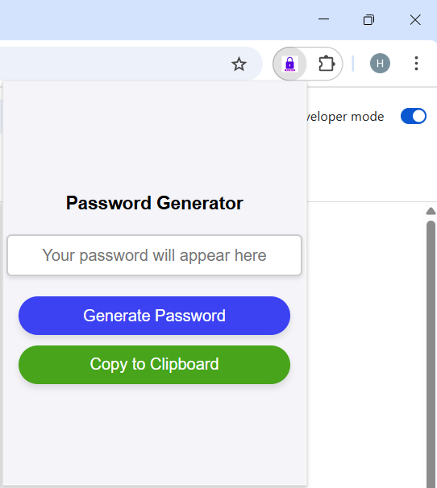

# ChromePass - Password Generator Chrome Extension

ChromePass is a lightweight Chrome extension that allows users to generate secure passwords and copy them to the clipboard with ease.

## Features

- Generate random, secure passwords.
- Copy generated passwords to the clipboard with a single click.
- User-friendly interface with responsive design.

## Installation

1. Clone or download this repository to your local machine.
2. Open Chrome and navigate to `chrome://extensions/`.
3. Enable **Developer mode** (toggle in the top-right corner).
4. Click **Load unpacked** and select the folder containing this project.
5. The extension will now appear in your Chrome toolbar.

## Usage

1. Click on the ChromePass icon in the toolbar to open the popup.
2. Click the **Generate Password** button to create a random password.
3. Click the **Copy to Clipboard** button to copy the password to your clipboard.
4. A confirmation message will appear indicating the password has been copied.

## Files

- `popup.html`: The HTML file for the extension's popup interface.
- `popup.js`: The JavaScript file containing the logic for password generation and clipboard functionality.
- `manifest.json`: The configuration file for the Chrome extension.

## Screenshots

## License

This project is licensed under the MIT License.

## Contributing

Contributions are welcome! Feel free to open an issue or submit a pull request.

## Contact

Would love to hear your thoughts or feedback!
